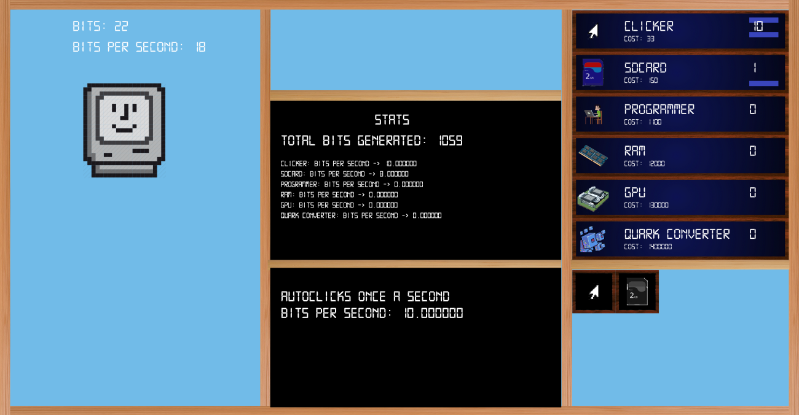

[Based on the hit browser game Cookie Clicker](https://orteil.dashnet.org/cookieclicker/), this was my final project for CS 126.

Project I worked on for a few weeks at the end of my freshman year. Utilizing several different OpenFramework modules, such as the visual and json ones, I was able to create all the functionality necessary for a game, such as a UI and save/load functions.
