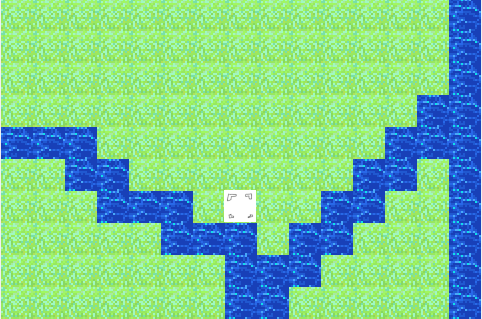

Link to the repository -> [here](https://github.com/afei3/fer)

# Overview
Mechanically similar to gameplay of [Fire Emblem](https://en.wikipedia.org/wiki/Fire_Emblem), this project is mostly me working on my own time, not only reverse engineering mechanics, but also practice adding new ideas in.

This is being done in C++, using the [SDL 2](https://lazyfoo.net/tutorials/SDL/) library, for graphics.

For map generation, I am currently using [BwdYeti's](https://forums.serenesforest.net/index.php?/topic/50953-fe-map-creator-also-generates-random-maps/) map creator.

A list of things I plan to work on at a bare minimum follows:
- Units
- Items
- Combat system
- Sprite movement

Updates:

8-18-2021

The game currently supports movement of the cursor on screen using the directional keys, as well as animation. Also implemented, but not shown is the path finding algorithm that can properly stop at the rivers and move along the plains.

Will plan on working on it during final year.
